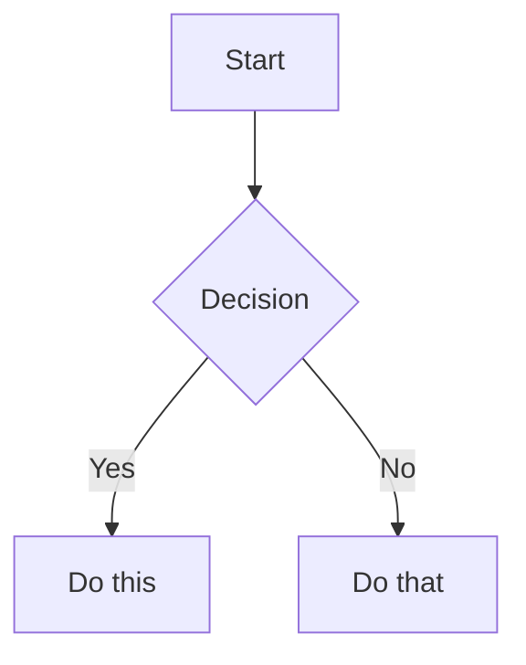

# Obsidian Flavored Markdown 技能

创建和编辑有效的 Obsidian Flavored Markdown。Obsidian 通过 wikilinks、嵌入、callouts、属性、注释和其他语法扩展了 CommonMark 和 GFM。此技能仅涵盖 Obsidian 特定的扩展 —— 假定已掌握标准 Markdown（标题、粗体、斜体、列表、引用、代码块、表格）。

## 工作流：创建 Obsidian 笔记

1. **添加 frontmatter**，在文件顶部包含属性（标题、标签、别名）。有关所有属性类型，请参阅 [PROPERTIES.md](references/PROPERTIES.md)。
2. **编写内容**，使用标准 Markdown 进行结构化，加上下面的 Obsidian 特定语法。
3. **链接相关笔记**，使用 wikilinks（`[[Note]]`）进行内部 vault 连接，或使用标准 Markdown 链接进行外部 URL 连接。
4. **嵌入内容**，使用 `![[embed]]` 语法嵌入其他笔记、图像或 PDF。有关所有嵌入类型，请参阅 [EMBEDS.md](references/EMBEDS.md)。
5. **添加 callouts**，使用 `> [!type]` 语法突出显示信息。有关所有 callout 类型，请参阅 [CALLOUTS.md](references/CALLOUTS.md)。
6. **验证**笔记在 Obsidian 的阅读视图中渲染正确。

> 在 wikilinks 和 Markdown 链接之间选择时：对 vault 内的笔记使用 `[[wikilinks]]`（Obsidian 会自动跟踪重命名），仅对外部 URL 使用 `[text](url)`。

## 内部链接 (Wikilinks)

```markdown
[[Note Name]]                          链接到笔记
[[Note Name|Display Text]]             自定义显示文本
[[Note Name#Heading]]                  链接到标题
[[Note Name#^block-id]]                链接到块
[[#Heading in same note]]              同笔记标题链接
```

通过将 `^block-id` 附加到任何段落来定义块 ID：

```markdown
This paragraph can be linked to. ^my-block-id
```

对于列表和引用，将块 ID 放在块之后单独的一行上：

```markdown
> A quote block

^quote-id
```

## 嵌入

在任何 wikilink 前加上 `!` 以内联嵌入其内容：

```markdown
![[Note Name]]                         嵌入完整笔记
![[Note Name#Heading]]                 嵌入部分
![[image.png]]                         嵌入图像
![[image.png|300]]                     嵌入带有宽度的图像
![[document.pdf#page=3]]               嵌入 PDF 页面
```

有关音频、视频、搜索嵌入和外部图像，请参阅 [EMBEDS.md](references/EMBEDS.md)。

## Callouts

```markdown
> [!note]
> 基本 callout。

> [!warning] 自定义标题
> 带有自定义标题的 callout。

> [!faq]- 默认折叠
> 可折叠的 callout（- 折叠，+ 展开）。
```

常见类型：`note`、`tip`、`warning`、`info`、`example`、`quote`、`bug`、`danger`、`success`、`failure`、`question`、`abstract`、`todo`。

有关包含别名、嵌套和自定义 CSS callouts 的完整列表，请参阅 [CALLOUTS.md](references/CALLOUTS.md)。

## 属性 (Frontmatter)

```yaml
---
title: My Note
date: 2024-01-15
tags:
  - project
  - active
aliases:
  - Alternative Name
cssclasses:
  - custom-class
---
```

默认属性：`tags`（可搜索标签）、`aliases`（链接建议的替代笔记名称）、`cssclasses`（用于样式的 CSS 类）。

有关所有属性类型、标签语法规则和高级用法，请参阅 [PROPERTIES.md](references/PROPERTIES.md)。

## 标签

```markdown
#tag                    内联标签
#nested/tag             具有层级的嵌套标签
```

标签可以包含字母、数字（不能是第一个字符）、下划线、连字符和正斜杠。标签也可以在 frontmatter 的 `tags` 属性下定义。

## 注释

```markdown
This is visible %%but this is hidden%% text.

%%
整个块在阅读视图中是隐藏的。
%%
```

## Obsidian 特定格式

```markdown
==Highlighted text==                   高亮语法
```

## 数学 (LaTeX)

```markdown
内联: $e^{i\pi} + 1 = 0$

块级:
$$
\frac{a}{b} = c
$$
```

## 图表 (Mermaid)

````markdown

````

要将 Mermaid 节点链接到 Obsidian 笔记，添加 `class NodeName internal-link;`。

## 脚注

```markdown
带有脚注的文本[^1]。

[^1]: 脚注内容。

内联脚注。^[这是内联的。]
```

## 完整示例

````markdown
---
title: Project Alpha
date: 2024-01-15
tags:
  - project
  - active
status: in-progress
---

# Project Alpha

该项目旨在通过现代技术[[improve workflow]]。

> [!important] 关键截止日期
> 第一个里程碑将在 ==January 30th== 到期。

## 任务

- [x] 初始计划
- [ ] 开发阶段
  - [ ] 后端实现
  - [ ] 前端设计

## 笔记

该算法使用 $O(n \log n)$ 排序。详细信息请参阅 [[Algorithm Notes#Sorting]]。

![[Architecture Diagram.png|600]]

在 [[Meeting Notes 2024-01-10#Decisions]] 中进行了审查。
````

## 参考资料

- [Obsidian Flavored Markdown](https://help.obsidian.md/obsidian-flavored-markdown)
- [内部链接](https://help.obsidian.md/links)
- [嵌入文件](https://help.obsidian.md/embeds)
- [Callouts](https://help.obsidian.md/callouts)
- [属性](https://help.obsidian.md/properties)